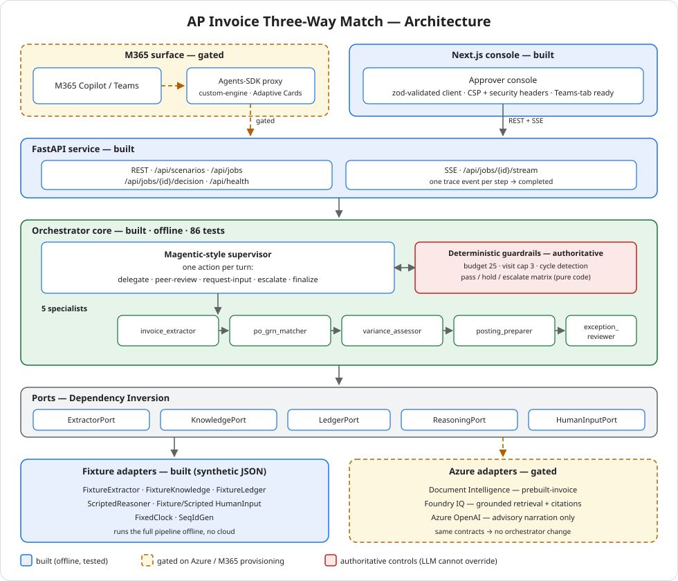

# Architecture

AP Invoice Three-Way Match Agent — *let AI participate in the finance process, but never let AI
break financial controls.*

This document is the hackathon's architecture-diagram deliverable. Components that require
Azure/M365 provisioning are marked **gated** — designed and ports-isolated, but not yet wired (see
[`ROADMAP.md`](ROADMAP.md)).

> The diagram is a self-contained SVG ([`architecture.svg`](architecture.svg)) and renders inline on
> GitHub. Edit the SVG to update it.

## Walk-through

**Surface (gated).** In the target state an approver asks *"Process invoice INV-1042"* inside
**M365 Copilot or Teams**; an **M365 Agents-SDK** proxy calls the backend and renders results —
including slot-fill prompts — as Adaptive Cards. Today the same backend is driven by the CLI, the
tests, and the Next.js console.

**API (built).** A **FastAPI** service exposes the offline runner: list scenarios, create and fetch
jobs, record a human decision, and — the centerpiece — a **Server-Sent Events** stream emitting one
`trace` event per supervisor step then a terminal `completed`. The wire contract is identical
whether the run is instant offline replay or later pushed live behind Azure latency, so the frontend
never changes.

**Orchestrator core (built, offline, 86 tests).** A **Magentic-style supervisor** asks a brain for
the next action and emits one move per turn from a closed set —
`delegate` / `peer-review` / `request-input` / `escalate` / `finalize` — routing over **5
specialists** in dependency order
(`invoice_extractor → po_grn_matcher → variance_assessor → posting_preparer → exception_reviewer`).
State threads through an append-only **envelope** (handoff history, per-role results, exception
ledger, budget).

**Guardrails are authoritative over the LLM.** A pre-flight before every delegation enforces a
tool-call budget (25), a per-role visit cap (3), and **cycle detection**; any veto routes to a
human. The final `pass / hold / escalate` verdict comes from a **deterministic decision matrix** —
the exception reviewer writes the summary but cannot change the verdict. With the Pydantic
invariants (money as `Decimal`, posting balanced to the cent, tolerance bounds), a variance never
silently auto-posts.

**Ports & adapters (Dependency Inversion).** Specialists and the supervisor depend only on narrow
**port protocols** — `ExtractorPort`, `KnowledgePort`, `LedgerPort`, `ReasoningPort`,
`HumanInputPort` (plus injected `Clock`/`IdGen`). This seam lets the project ship a complete,
demoable offline product independent of cloud provisioning.

**Adapters: built vs. gated.** Today the ports are satisfied by **fixture adapters** over synthetic
JSON in `sample-data/` — first-class implementations that run the full pipeline and pin the data
shapes the cloud adapters must produce. The **Azure adapters** (gated) drop in behind the same
contracts with **no orchestrator change**: Document Intelligence as extractor, **Foundry IQ** as the
knowledge port (grounded retrieval + clickable citations), Azure OpenAI as the reasoning port. The
`ReasoningPort` produces text, never decisions — the controls always decide.

**Console (built — scaffold).** A **Next.js** approver console consumes the SSE stream and the REST
endpoints through one **zod-validated** API client (every response is parsed before it reaches the
UI). It ships a hardened baseline — a tight CSP, `X-Content-Type-Options`, `Referrer-Policy`,
`Permissions-Policy` — with `frame-ancestors` scoped to embed as a Microsoft Teams personal tab.
